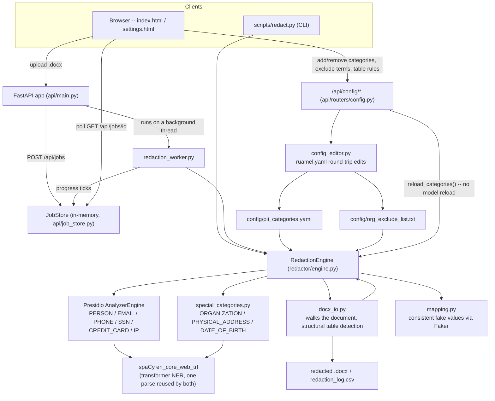

# BetterRedactionTool

Redacts PII from a `.docx` file and replaces it with consistent, realistic
fake values (the same real value always maps to the same fake value
everywhere in the document, e.g. every "Rohan Dey" becomes the same fake
name). Ships two ways to use it: a one-line CLI command, and a small web
app with a progress bar and a point-and-click settings page for
customizing what gets redacted.

## Architecture



The same `RedactionEngine` backs both entry points (CLI and web); the web
app just adds a job queue, a progress bar, and a settings UI for editing
the two config files without touching YAML directly.

## Getting started (from scratch)

This assumes nothing is installed yet beyond a computer.

### 1. Prerequisites

- **Python 3.11 or newer.** Check with `python --version` (or `python3
  --version` on macOS/Linux). If that fails, install from
  [python.org](https://www.python.org/downloads/).
- **~3 GB of free disk space.** The transformer NLP model and its
  dependencies (PyTorch, etc.) are the bulk of this.
- A terminal (Command Prompt/PowerShell on Windows, Terminal on
  macOS/Linux) opened in this project's folder.

### 2. Create a virtual environment (recommended, keeps this project's
packages separate from everything else on your machine)

```bash
python -m venv .venv
```

Activate it -- you'll need to do this every time you open a new terminal
to work on this project:

```bash
# Windows (PowerShell)
.venv\Scripts\Activate.ps1
# Windows (Git Bash / cmd)
source .venv/Scripts/activate
# macOS / Linux
source .venv/bin/activate
```

You'll know it worked because your terminal prompt gets a `(.venv)`
prefix.

### 3. Install dependencies

```bash
pip install -r requirements.txt
python -m spacy download en_core_web_trf
```

The second command downloads the NLP model this tool uses to find names
and company names (~500 MB) -- it only needs to run once, and it'll take
a few minutes depending on your connection.

### 4. Try it: command line

```bash
python scripts/redact.py "path/to/input.docx" "output/redacted.docx"
```

This writes two files:
- `output/redacted.docx` -- the redacted document, same formatting as the input.
- `output/redacted.redaction_log.csv` -- every `(category, original value, fake value)`
  triple that was changed, for audit purposes.

### 5. Try it: the web app (recommended if you want to see progress, or
customize what gets redacted without editing files)

```bash
uvicorn api.main:app --reload
```

Then open **http://127.0.0.1:8000** in a browser. Drag in a `.docx`,
watch the progress bar (it shows a live estimated time remaining once
it's processed enough of the document to extrapolate a rate), and
download the result when it finishes. The first run will take longer
while the NLP model loads into memory -- after that, submitting more
jobs is fast per-job (the model stays loaded between jobs).

### 6. Customize what gets redacted (the gear icon, top-right of the
upload page, or go directly to http://127.0.0.1:8000/settings.html)

No YAML, no code -- three tabs:

- **Categories**: turn a PII type on/off, or add a brand-new one matched
  by a regular expression (an employee ID, a passport number, anything
  with a consistent shape). Fill in a name, one regex pattern per line, a
  confidence threshold, and what kind of fake value to generate ("company",
  "name", "ssn", etc. -- any method name from
  [Faker](https://faker.readthedocs.io/en/master/providers.html)).
- **Table layouts**: if a document has a personnel/KYC-style table (e.g.
  "Full Name | SSN | Residence") using different column headers than
  this tool already knows about ("Name | Designation | DIN | Address"),
  add a rule here instead of editing `redactor/docx_io.py`. Say which
  column header to redact, what to redact it as (PERSON, for instance),
  and which other column header the table also needs to have for this
  rule to apply (so a rule for "name" doesn't accidentally fire on some
  unrelated table that happens to have a "name" column).
- **Exclude list**: names that should *never* be redacted as a company,
  even if the model flags them -- your own company's name, a regulator,
  a vendor you want left visible in the output.

Every change here takes effect on the **next** file you submit --
immediately, without restarting the server or reloading the (slow) NLP
model (see `redactor/engine.py`'s `reload_categories()` for how).

### 7. (Optional) Run the evaluation suite

See `EVALUATION.md` for the full methodology and results. To reproduce:

```bash
python scripts/build_ground_truth.py "Red Herring Prospectus.docx" ground_truth/ground_truth.jsonl
python scripts/evaluate.py "Red Herring Prospectus.docx" ground_truth/ground_truth.jsonl
```

## Customizing, in more detail

There are three distinct levels, from "no files touched at all" to
"needs a code change" -- same three things the settings UI above exposes,
documented here for when you'd rather edit the files directly (or
understand what the UI is actually doing):

1. **Turn a category on/off, or add a simple regex-based one.** This is
   `config/pii_categories.yaml` (or the Settings UI's "Categories" tab,
   which edits this same file). Presence in the file *is* the on/off
   switch -- delete a category's block and it stops being detected,
   nothing else needs to change. There's a working example for adding a
   `PASSPORT_NUMBER` type right there in the file's comments.
2. **Tell it "this specific thing isn't actually PII," or teach it a new
   table layout.** `config/org_exclude_list.txt` (a plain list of names
   to never redact as a company) and `pii_categories.yaml`'s
   `structural_table_columns` section (header-keyword rules for
   personnel/KYC-style tables) -- both editable through the Settings UI's
   "Exclude list" and "Table layouts" tabs, or by hand.
3. **A category that needs its own logic** (a deny-list, a keyword
   context check, table-structure awareness -- like ORGANIZATION,
   PHYSICAL_ADDRESS, and DATE_OF_BIRTH today) needs one small function in
   `redactor/special_categories.py`, wired into
   `RedactionEngine._detect_all()` with a few lines following the shape
   the existing three already use. This is the one level that's a real
   code change, not a config edit -- `api/config_editor.py` deliberately
   refuses to let the Settings UI delete these ("code-backed" badge in
   the Categories tab) since removing the YAML entry alone wouldn't
   actually stop the function from running.

### Does it work on other documents?

Yes -- the detection pipeline isn't hardcoded to the IPO prospectus this
was built against. Fully generic out of the box: EMAIL_ADDRESS,
PHONE_NUMBER, US_SSN, CREDIT_CARD, IP_ADDRESS, DATE_OF_BIRTH, PERSON. The
ORGANIZATION glossary auto-exclusion (any document with a "Term |
Description" table has its own defined terms picked up automatically) is
self-adapting per document too. What benefits from a config nudge on a
genuinely different document: table layouts that don't match the
existing `structural_table_columns` rules (add one, per above), and
jargon/entities specific to that document's domain that aren't yet on the
exclude list (same process used to build the current list: run it, see
what it got wrong, add a line).

## Methodology comparison

Several different techniques are combined, each used where it's
strongest. This isn't a single "we chose X" decision -- it's a
record of what was tried and why each piece landed where it did (full
numbers in `EVALUATION.md`).

| Approach | Used for | Pros | Cons |
|---|---|---|---|
| **Presidio built-in recognizers** (regex + checksum/format validation) | EMAIL_ADDRESS, PHONE_NUMBER, US_SSN, CREDIT_CARD, IP_ADDRESS | Deterministic, fast, near-1.00 precision/recall for anything with a fixed syntactic shape; no model inference needed | Useless for anything without a reliable shape -- can't find a name or a company this way |
| **spaCy NER -- `en_core_web_lg`** (static word vectors + shallow CNN) | Earlier version's PERSON/ORGANIZATION detection | Fast (~45s for this 446K-char document), small download (~800 MB), runs fine on CPU | Measurably unreliable on short, context-free spans -- a paragraph that's *just* `"HDFC Bank Limited"` was often missed entirely even though the same string is caught correctly inside a full sentence. Superseded. |
| **spaCy NER -- `en_core_web_trf`** (RoBERTa transformer) | Current PERSON/ORGANIZATION detection | Dramatically better on the same context-free-span failure mode (measured: PERSON precision/recall 0.56/0.83 -> 0.72/0.95, ORGANIZATION 0.40/0.79 -> 0.69/0.89); MIT license; drop-in swap in the same pipeline, no new dependency ecosystem | ~5-8x slower (45s -> 4-6 min on this document, CPU-only); bigger download and more RAM |
| **GLiNER** (zero-shot, PII-specific pretrained model) | Evaluated as a candidate, **not adopted** | Zero-shot (new entity labels at inference time, no fine-tuning); purpose-built for PII; small | Measured *worse* than `en_core_web_trf` on this document for both categories, and dramatically worse on ORGANIZATION specifically (precision as low as 0.09-0.17 even with the identical deny-list applied) -- its "company" label wasn't well-calibrated for dense legal jargon |
| **Regex + nearby-keyword context** | DATE_OF_BIRTH (date pattern + "date of birth"/"born on" within 40 chars), label-anchored name patterns (`"Contact Person: X"`) | Fully deterministic and explainable; avoided flagging the hundreds of unrelated legal dates in this document | Brittle to phrasing outside what was anticipated -- only catches the keyword shapes it was written for |
| **Structural table-column detection** (header-keyword driven, no model call) | PERSON / PHYSICAL_ADDRESS / DIRECTOR_ID_NUMBER inside personnel/KYC tables | Far more reliable than NER for a bare value sitting alone in a cell (measured 1.00 precision/recall for PHYSICAL_ADDRESS and DIRECTOR_ID_NUMBER on this dataset); no model inference cost for these cells | Only fires for tables matching a known layout -- a differently-labeled table needs a new rule (Settings UI's "Table layouts" tab, or `structural_table_columns` in YAML) |
| **Deny-list / glossary auto-exclusion** | ORGANIZATION precision | Cheap, fully auditable, self-adapting (a document's own "Term \| Description" table is read automatically) | Needs manual curation for jargon not defined anywhere in the document itself; substring-matching needs care (a real bug here -- single-word terms over-matching -- is documented in EVALUATION.md) |

## Known false positives / false negatives

(Full numbers, and the head-to-head model comparison behind the table
above, in `EVALUATION.md`.) In short: EMAIL_ADDRESS, PHONE_NUMBER,
PHYSICAL_ADDRESS and DIRECTOR_ID_NUMBER are syntactically distinctive
enough to be detected at or near 1.00 precision/recall. PERSON and
ORGANIZATION are harder -- free-text NER on a dense, jargon-heavy legal
document -- and have real, measured gaps:

- **False positives**: place-name/building-name fragments inside a
  (deliberately unredacted) corporate address occasionally get mistagged
  as ORG or PERSON ("Bandra Kurla Complex", "Off Pallod Farms").
  Financial/legal jargon not covered by the glossary deny-list
  occasionally gets mistagged as ORG ("Adjusted EBITDA"-adjacent phrases).
- **False negatives**: a real company name sitting completely alone in a
  short table cell/paragraph, with zero surrounding sentence, is
  occasionally still missed even by a transformer model, just far less
  often than before.

Both are inherent to NER-based detection on this kind of document, not
implementation bugs; the Settings UI's exclude-list and table-layout
tabs are the intended way to close gaps like these as more are found on
a given document, without a code change.

## Precision policy: numeric identifiers that aren't PII

Applying the same reasoning spec.md invites for "Order"/"Ticket" numbers:
this document is full of company/registration identifiers that are
structurally similar -- the CIN (Corporate Identity Number), SEBI
registration numbers, firm registration numbers. **None of these are
redacted, on purpose.** They identify a company or a registration, not a
natural person -- the same line drawn for "company name" scope generally.
The one place this needed an actual code fix, not just a decision: spaCy
was initially mistagging SEBI registration numbers (e.g. `INR000004058`)
as ORGANIZATION, since they're alphanumeric and capitalized; a pattern
filter in `redactor/special_categories.py` now recognizes and excludes
that shape. The flip side of the same line: DIRECTOR_ID_NUMBER (DIN) *is*
redacted, even though it's also a government-issued alphanumeric code --
because a DIN identifies one specific individual director, not a company
or a transaction. The boundary is identifies-a-person vs.
identifies-an-entity-or-transaction, applied consistently.

## Formatting tradeoff

A paragraph is often split across several `runs` (e.g. one bold word in
an otherwise plain sentence). Redaction rewrites the whole paragraph's
text into the first run and clears the rest -- this keeps the paragraph's
overall look but does not preserve formatting that changes *mid-sentence*.
Documented rather than solved because word-level format-preserving
substitution is a large increase in complexity for a cosmetic issue.

## Project layout

```
config/pii_categories.yaml       # every PII category: how to detect it, how to fake it
config/org_exclude_list.txt      # regulator/statute deny-list for ORGANIZATION
redactor/engine.py               # RedactionEngine: detect + replace, orchestrates everything below
redactor/special_categories.py   # ORGANIZATION / PHYSICAL_ADDRESS / DATE_OF_BIRTH logic
redactor/mapping.py              # consistent fake-value generation
redactor/docx_io.py              # walks the .docx, applies redactions, writes the output
redactor/config.py               # loads the two config files above
scripts/redact.py                # CLI: redact a .docx
scripts/extract_text.py          # dumps every paragraph/cell to JSONL (used by the eval tooling)
scripts/build_ground_truth.py    # builds ground_truth/ground_truth.jsonl (see EVALUATION.md)
scripts/evaluate.py              # precision/recall/F1 report against the ground truth
ground_truth/known_entities.py   # hand-compiled master list of real names/companies in this document
output/                          # redacted.docx + its redaction log
api/                             # FastAPI backend: upload -> async job -> progress -> download
api/config_editor.py             # reads/writes the two config files above for the Settings UI
api/routers/config.py            # /api/config/* -- Settings UI's backend
api/static/                      # index.html (upload), settings.html (customize), shared style.css/app.js
Dockerfile                       # containerized api/ for deployment
```
